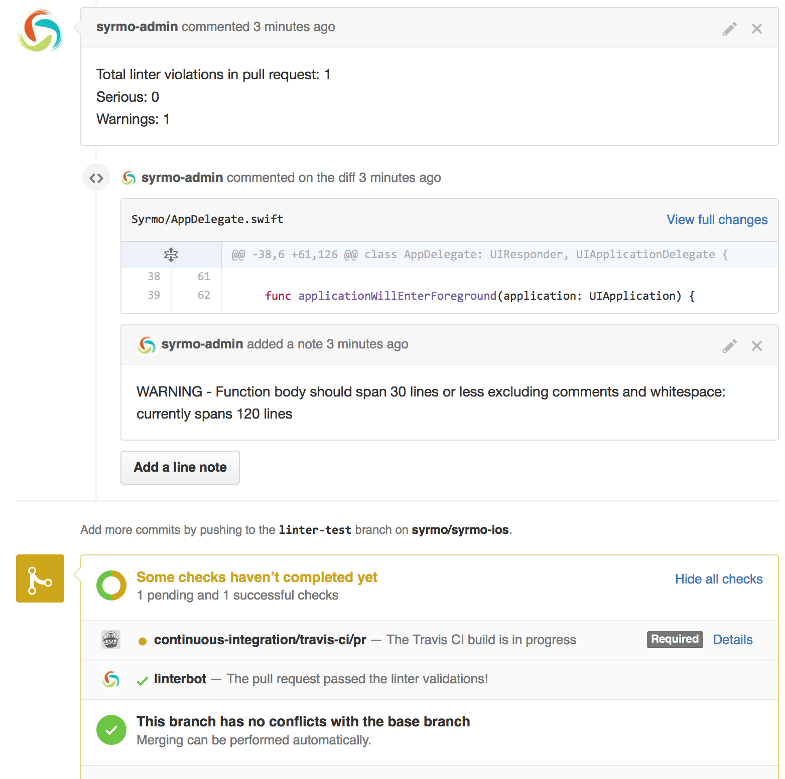

# Linterbot

[](https://badge.fury.io/rb/linterbot)

A bot that parses [SwiftLint](https://github.com/realm/SwiftLint) output and analyzes a GitHub pull request. Then for each linter violation it will make comment in the pull request diff on the line where the violation was made.



## Installation

Add this line to your application's Gemfile:

```ruby
gem 'linterbot'
```

And then execute:

    $ bundle

Or install it yourself as:

    $ gem install linterbot

## Usage

### Locally

If you want to try it locally:

```
swiftlint --reporter json | linterbot REPOSITORY PULL_REQUEST_NUMBER
```

### TravisCI

If you want to run it in TravisCI for every pull request triggered build you can create a script (with execution permission) called `linter` with the following content:

```bash
#!/bin/bash

if [ "$TRAVIS_PULL_REQUEST" != "false" ]
then
  swiftlint --reporter json > switlint-report.json || false
  linterbot $TRAVIS_REPO_SLUG $TRAVIS_PULL_REQUEST < swiftlint-report.json
fi
```
*`|| false` avoids a build fail if there are severe lint error*

Finally in your `.travis.yml` file:

```yml
language: objective-c
osx_image: xcode7.2
before_install:
- gem install bundler
- gem install linterbot
- brew install swiftlint
script:
- linter
- xcodebuild clean build test -project YourProject.xcodeproj -scheme YourProject
```

For more help run:

```
linterbot -h
```

and if you want to check all the available options for the `run` command (which is the default command to be run if none is provided) then run:

```
linterbot help run
```

### GitHub access

In order for linterbot to be able to comment on your pull request it needs write access to the specified repository. Remember to add the `repo` scope when you create the GitHub access token. If you don't lintebot won't be able to run. For more information on how to create an access token check [this](https://help.github.com/articles/creating-an-access-token-for-command-line-use/) tutorial. If you want to know more about GitHub's OAuth scopes check [this](https://developer.github.com/v3/oauth/#scopes) section in their documentation.

You can provided an access token by either using the environmental variable `GITHUB_ACCESS_TOKEN` or using the `.linterbot.yml` (which should not be committed to your git repository).

### Configuration file

You can define some configuration parameters in configuration file. By default `linterbot` will try to load `.linterbot.yml` from the current working directory. You can change it using the `--config-file-path` option.

The following are the supported parameters you can configure in the `.linterbot.yml` file:

```yml
github_access_token: 'YOUR_GITHUB_ACCESS_TOKEN'
linter_report_file: 'PATH/TO/SWIFTLINT/JSON/OUTPUT/FILE'
project_base_path: 'BASE/PROJECT/PATH'
```

By default `linterbot` will read from the standard input the JSON output of the `swiftlint lint --reporter json` command. You can tell `linterbot` to read the `swiftlint` output from a specific file either using the `--linter-report-file-path` option or through the `.linterbot.yml` file.

The base path of project must be provided. By default the current working directory where `linterbot` was executed is used. You can change it either using the `--project-base-path` or through the `.linterbot.yml` file.

## Development

After checking out the repo, run `bin/setup` to install dependencies. Then, run `rake spec` to run the tests. You can also run `bin/console` for an interactive prompt that will allow you to experiment.

To install this gem onto your local machine, run `bundle exec rake install`. To release a new version, update the version number in `version.rb`, and then run `bundle exec rake release`, which will create a git tag for the version, push git commits and tags, and push the `.gem` file to [rubygems.org](https://rubygems.org).

## Contributing

Bug reports and pull requests are welcome on GitHub at https://github.com/guidomb/linterbot.


## License

The gem is available as open source under the terms of the [MIT License](http://opensource.org/licenses/MIT).
